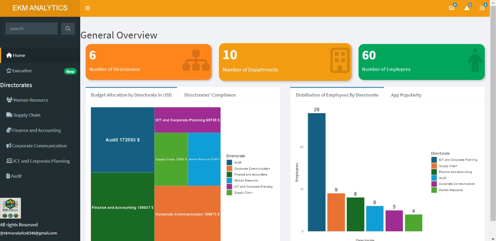

<h1 align="center">👋 Hi, I'm Esdras Koome Micheni</h1>

  <em>The relentless data whisperer with a coder’s heart, a strategist’s mind, and a hustler’s spirit.</em>

---

## 🚀 About Me

I'm a passionate **Mathematician**, **Data Scientist**, and **R Shiny Developer** with a strong technical foundation and a heart for community-driven innovation. From crafting custom dashboards for organizations to building mobile-based data systems for milk farmers, I thrive at the intersection of data, design, and decision-making. 

---

## 🛠️ Tech Stack

| Languages | Tools & Frameworks | Data Skills | Other |
|----------|-------------------|-------------|-------|
| R • Python • Java • SQL | Shiny • Dash • Kobo Collect • Power BI • MySQL | Data Analysis • Visualization • Reporting • EDA • Database Management | Git • GitHub • Excel |

---

## 📊 Featured Projects

### 🔷 [EKM Analytics Dashboard (R Shiny)](https://github.com/ekomsaye/EKM-ANALYTICS-FIRM-R-SHINY-DASHBOARD)

> A visually rich dashboard created for the EKM Analytics Firm and its six directorates. It features interactive charts, customized info boxes, and value boxes with a modern UI.

  
  

---

### 📱 [Field Data Collection System (Kobo Collect + R Shiny)](https://github.com/EsdrasMicheni/field-data-collection-kobo)

> Designed a mobile data collection platform using Kobo Collect integrated with a backend MySQL database and R Shiny dashboard for real-time visualization and decision support in rural agriculture.

---

## 💡 Soft Skills

✅ Strong problem-solving abilities  
✅ Clear communication and teamwork  
✅ Detail-oriented and proactive  
✅ Quick learner and adaptable

---

## 📬 Connect With Me

- 📧 Email: [esdraskoome@gmail.com](mailto:esdraskoome@gmail.com)  
- 💼 [LinkedIn](https://www.linkedin.com/in/esdras-koome-micheni-106651338/)  
- 🧑‍💻 [Upwork Profile](https://www.upwork.com/freelancers/~01bbdaff1dc6ce0241)  
- ▶️ [YouTube Channel](https://www.youtube.com/channel/UCBhBTBAanuBNiQs3r7mwDmA)

---

## 📈 GitHub Stats

  

